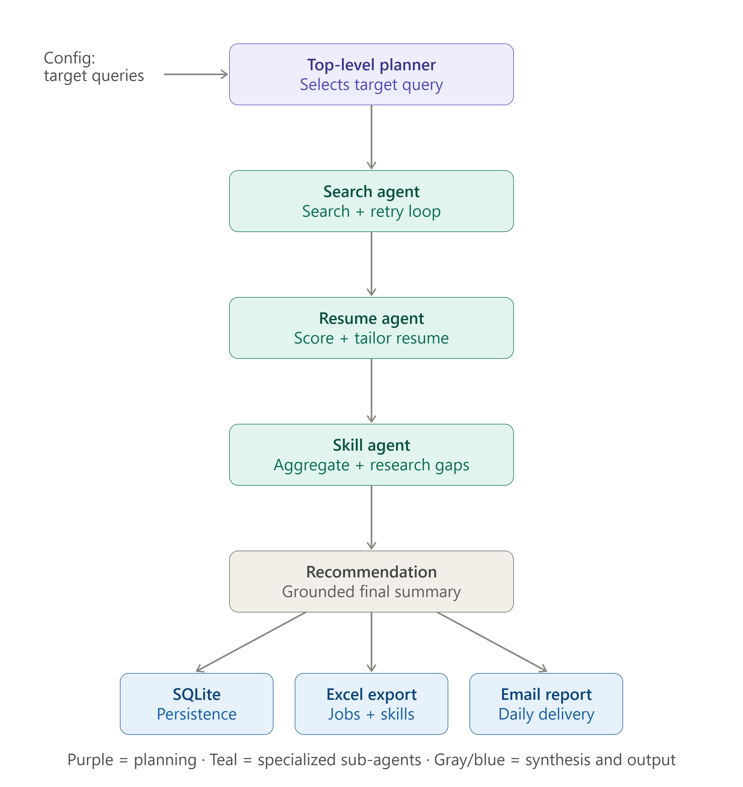

# Job Search AI Agent

A multi-agent AI system that autonomously discovers, evaluates, and reports on job opportunities matched against a candidate's real resume — built as a production-grade portfolio project demonstrating applied agentic AI engineering.

## 1. Problem Statement

Job searching at a senior/specialist level is inefficient in three specific ways:

- **Discovery is manual and repetitive.** Searching multiple job boards daily for the same set of role variations is time-consuming and easy to neglect.
- **Relevance is hard to judge at scale.** A human can't read 50+ full job descriptions a day and accurately judge fit against their own resume, especially across ambiguous or non-standard titles.
- **Market signal is invisible.** Candidates rarely have a systematic, evidence-based view of which specific skills are actually being requested across current job postings for their target roles — most "what should I learn next" decisions are guesswork.

This project addresses all three with one system: it searches, it judges fit against a real resume using an LLM, and it aggregates the evidence into a concrete skill-gap report — while tracking applications so nothing is duplicated or lost.

## 2. Business Case

| Without this system | With this system |
|---|---|
| Manually search 5-7 job boards/queries daily | One scheduled run covers multiple sources and target roles |
| Read full job descriptions to judge fit | LLM-scored match level, matched/missing skills, per job |
| No memory of what's already been seen or applied to | Persistent, deduplicated history across every run |
| Generic "learn Python" type advice | Skill gaps derived from real, current job postings, with concrete first steps |
| No visibility into application status | A single tracked, exportable, always-current pipeline |

The system is designed to be genuinely used daily, not a demo — every design decision (persistence, deduplication, crash isolation, cost control) reflects that.

## 3. Architecture

A top-level planner coordinates three independent, specialized sub-agents. Each sub-agent is a fully self-contained LangGraph graph with its own internal state and reasoning, built and verified in isolation before being wired together.



Design principle throughout: state is explicitly translated at each agent boundary, not shared as one global object. Each agent receives only what it needs and returns only its result — the outer graph has no visibility into how, for example, Search Agent internally decided it had "enough" results.

## 4. Tech Stack

| Layer | Technology | Purpose |
|---|---|---|
| Orchestration | LangGraph | Multi-agent graph definition, state management, conditional routing |
| LLM tooling | LangChain, langchain-groq | Tool-calling, prompt templating, LLM client abstraction |
| LLM inference | Groq (Llama 3.3 70B) | Resume-job matching, resume tailoring, skill research, query planning |
| Job data | JSearch API (RapidAPI), Adzuna API | Two independent job search sources |
| Persistence | SQLite | Scored jobs, application tracking, API usage history |
| Data export | pandas, openpyxl | Excel report generation |
| Notification | Gmail SMTP | Daily automated report delivery |
| Language | Python 3.11+ | — |

## 5. AI Engineering Concepts Applied

- **Multi-agent orchestration** — independent sub-agents with their own state, composed via a top-level graph, not a single monolithic agent
- **Tool calling / function calling** — `@tool`-decorated functions (`search_jobs`, `search_jobs_adzuna`, `score_job`) invoked by the LLM with self-generated arguments
- **Agentic loops with guardrails** — Search Agent's internal retry loop is bounded by a hard attempt cap, preventing runaway API usage regardless of LLM judgment
- **Grounded generation** — the Recommendation step is given real scored data directly in its prompt, structurally preventing hallucination rather than merely instructing the model not to hallucinate
- **Fabrication guard (LLM output verification)** — every job the LLM attempts to score is checked against a registry of jobs a real search call actually returned; anything else is rejected and logged, never persisted
- **Prompt engineering** — structured, constrained prompts (explicit JSON schema requests, "reply ONLY with..." patterns) isolated into a dedicated prompts module
- **Caching for cost control** — previously-scored jobs are never re-sent to the LLM
- **Cost-bounded expensive operations** — resume tailoring and skill research are deliberately restricted to only the highest-value cases (High matches, top-N gaps), not applied indiscriminately
- **Rate-limit-aware resilience** — exponential backoff with a distinction between recoverable (per-minute) and unrecoverable (daily) limits, failing fast on the latter instead of wasting retries
- **Proactive budget guarding** — real per-call token usage is recorded and checked against published rate limits before the next call fires, rather than only reacting to failures after the fact

## 6. Problems Encountered During Development (and Resolutions)

| Problem | Root Cause | Resolution |
|---|---|---|
| LLM invented plausible-sounding fake job listings when given no real results to summarize | LLMs pattern-match to "what a summary looks like" even with no grounding data | Fabrication guard: reject and log any scored job not present in that session's real search results |
| Credibility filter rejected legitimate job sources (e.g. Adzuna's own redirect domain, Shine, Foundit) | Trusted-domain list was incomplete relative to actual sources in use | Expanded and audited the trusted-board list against real observed domains |
| Every log line printed multiple times | `logging.getLogger(name)` returns a shared singleton; handlers were re-added on every import across multiple modules | Added a guard (`if not logger.handlers:`) so handlers are only configured once |
| Tool responses of `[]` were rejected by the LLM provider | Groq's API requires non-empty content for any tool-role message | Search tools return an informational placeholder instead of an empty list when nothing new is found |
| `StructuredTool` object is not callable | `@tool`-decorated functions must be invoked via `.invoke({...})`, not called directly | Standardized all tool call sites to use `.invoke()` |
| Frequent 429 rate-limit errors under heavy same-day testing | Free-tier Groq limits (30 RPM / 1K RPD / 12K TPM / 100K TPD for Llama 3.3 70B) are easily exhausted with unthrottled, repeated testing | Built a proactive usage tracker with a pre-call budget guard, using a 90% safety margin against all four limit types |
| A single job's scoring failure or a single query's total failure could abort an entire run | No isolation between units of work | Per-job and per-query try/except boundaries; a failure is logged and the run continues |
| Excel export silently showed empty apply links | `apply_link` was an optional tool parameter the LLM sometimes omitted | Made `apply_link` a required parameter, removing the LLM's ability to skip it |

## 7. Rate Limit & Token Management

Groq's free-tier limits for the model in use (Llama 3.3 70B Versatile):

| Limit type | Value |
|---|---|
| Requests per minute (RPM) | 30 |
| Requests per day (RPD) | 1,000 |
| Tokens per minute (TPM) | 12,000 |
| Tokens per day (TPD) | 100,000 |

Measures taken:

- Every LLM response's real token usage (`response_metadata['token_usage']`) is recorded to a local table immediately after each call — actual usage, not estimates.
- Before every LLM call, a guard checks the last-60-seconds and today's totals against all four limits with a 90% safety margin, and refuses the call proactively if it would breach that margin — this catches problems before an API rejection, not just after.
- Retry logic distinguishes recoverable delays (Groq reports a short wait, e.g. seconds) from unrecoverable ones (a long suggested wait indicates a daily cap, which retrying cannot fix) and fails fast in the latter case rather than burning time on retries that cannot succeed.
- Expensive operations (resume tailoring, skill research) are deliberately scoped to only the highest-value subset of results, not applied to every item, keeping per-run token cost proportional to output value.

## 8. Setup

```bash
pip install -r requirements.txt
```

Create `.env`:

```
RAPIDAPI_KEY=...
GROQ_API_KEY=...
GMAIL_FROM=...
GMAIL_APP_PASSWORD=...
ADZUNA_APP_ID=...
ADZUNA_APP_KEY=...
```

Add resume text to `my_resume.txt`, set target roles in `config/settings.py` (`SEARCH_QUERIES`), then:

```bash
python main.py
```

Mark an application:

```bash
python mark_applied.py "Employer Name" "Job Title" [apply_link]
```

## 9. Repository Structure

```
job-ai-agent/
├── main.py                 # Entry point — orchestration only
├── mark_applied.py         # CLI utility
├── config/                 # Settings, prompts, target queries
├── db/                     # Persistence: scored jobs, applications, API usage
├── tools/                  # Search (JSearch, Adzuna) and scoring tools
├── graph/phase3/           # Multi-agent graph: planner + 3 sub-agents
├── utils/                  # Retry logic, logging
├── reports/                # Excel and summary generation
├── notifications/          # Email delivery
└── tests/                  # Module-level smoke tests
```

## 10. Current Limitations & Roadmap

**Known limitation:** the top-level planner makes one decision (which query to run) at the start of a run; execution afterward is deterministic regardless of intermediate results. A more adaptive design would consult the planner between agents — reacting to a Search Agent finding nothing, or a Resume Agent finding an unusually high yield of strong matches — rather than planning once, upfront.

**Near-term:**

- Scheduled, unattended execution (Windows Task Scheduler)
- Adaptive, outcome-aware planning between agents
- Query-history awareness to avoid re-selecting recently-exhausted queries

**Explicitly deferred:** observability/tracing (LangSmith), retrieval-augmented generation, cloud deployment — each treated as a distinct, deliberate learning effort rather than folded into this build.

---

Built as a hands-on demonstration of applied agentic AI engineering: orchestration, tool use, cost-aware LLM operation, and — deliberately — active, tested defenses against an LLM's own unreliability, not only its capability.